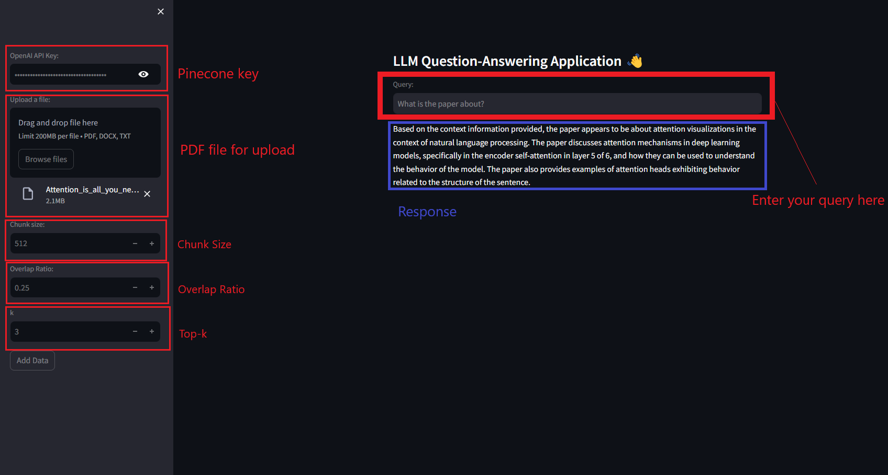

# COMS579-S24
RAG - NLP Project for spring 2024 - COMS-579 - TEAM Members Aditya Kota and Ankush Kumar Mishra

### Pipeline
Llamaindex

### Vector DB
PineCone

### UI
Streamlit

## Disclaimer
Code written on Linux Machine with Cuda version 10.1.243
To run on windows use Windows Subsytem for Linux (WSL)
https://learn.microsoft.com/en-us/windows/wsl/about

## Link to Video for Assignment 1

https://www.youtube.com/watch?v=ICqOk5AEkuI

## Link to Video for Assignment 2

https://youtu.be/s2puC6JEVyM

## Link to Video for Assignment 3

https://www.youtube.com/watch?v=O6wz8kwuHT8

## Directory Structure
```
your_project_directory/
│
├── upload.py
├── requirements.txt
│
└── Docs/
    └── your_pdf_file.pdf
```


In the current working directory there should be a "Docs" folder. The pdf file should be inside it.

## Installation Instruction


`pip install -r requirements.txt`


## How to run from Terminal

### Required Arguments

**--api_key**
Your Pinecone API key.

**--file_name**
The name of the PDF file to process.

### Optional Arguments

**--chunk_size**
Chunk size for splitting. Default = 128

**--overlap**
Overlap ratio between chunk. Should be between 0 and 1. Default 0.25


### Required arguments
`python3 upload.py --api_key <your_pinecone_api_key> --file_name <pdf_filename>`


### All arguments
`python3 upload.py --api_key <your_pinecone_api_key> --file_name <pdf_filename> --chunk_size <chunk_size_(default_128)> --overlap <overlap_ratio(default_0.25)>`

## For help


`python3 upload.py --help`

```
parser.add_argument("--api_key", type=str, required=True, help="Pinecone API key")
parser.add_argument("--file_name", type=str, required=True, help="PDF file name")
parser.add_argument("--chunk_size", type=int, default=128, help="Chunk size")
parser.add_argument("--overlap", type=restricted_float, default=0.25, help="Overlap btw chunks as a fraction btw 0 and 1")
```
Once you have uploaded the pdf as a Vector Database to Pincone the next step is to continue with asking queries to the RAG Model. This can be done by running the `query.py` file.
## How to run from Terminal

### Required Arguments

**--api_key**
Your Pinecone API key.

**--query**
The user query about the pdf.

### Optional Arguments

**--top_k**
Parameter for the retriever to fetch top k documents. Default = 5
`python3 query.py --api_key=29e930bd-afd3-436a-8782-40d774866b10 --query="What is a transformer?" --top_k=5`

## How to run from Terminal

`python3 -m streamlit run RAG_app.py`
Open the link that appears on the terminal in the browser and provide required information, For reference follow this image - 



